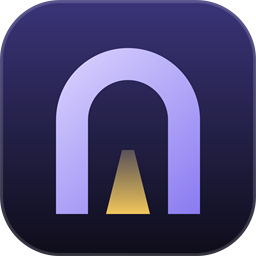
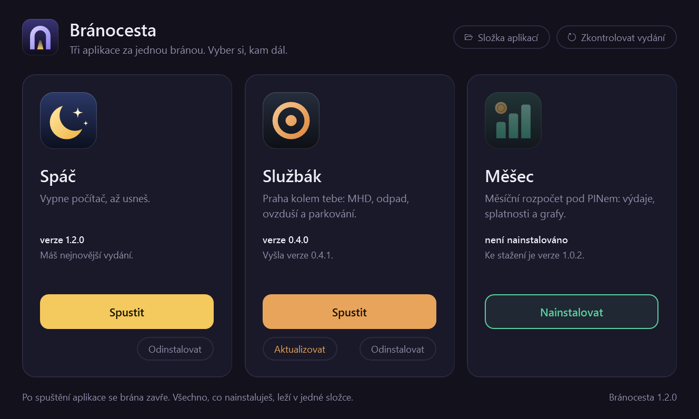

<p align="center">
  
</p>

<h1 align="center">Bránocesta</h1>

<p align="center">
  Jedna ikona na ploše místo tří. Brána ke <a href="https://github.com/JohnyLeeJohnes/spac">Spáči</a>,
  <a href="https://github.com/JohnyLeeJohnes/sluzbak">Službákovi</a> a
  <a href="https://github.com/JohnyLeeJohnes/mesec">Měšci</a>, která je sama nainstaluje a udržuje aktuální.
</p>

<p align="center">
  
</p>

Otevřeš bránu, klikneš na **Spustit** a jsi v aplikaci. Brána se přitom zavře, dál už vidíš jen to, co sis vybral.

- **Instaluje za tebe.** Při prvním spuštění stáhne z GitHubu nejnovější vydání všech tří aplikací.
  Nic neklonuješ, nic nerozbaluješ.
- **Hlídá nová vydání.** Při každém otevření se podívá, jestli nevyšlo něco novějšího, a rovnou to nainstaluje.
- **Nezdržuje.** Co už je nainstalované, jde spustit hned, i když kontrola ještě běží nebo nejsi na internetu.
- **Nic se nekompiluje.** Dva skripty v PowerShellu a jedno okno v XAML, stejně jako aplikace za bránou.

## Instalace

1. Stáhni **[Branocesta.zip](https://github.com/JohnyLeeJohnes/branocesta/releases/latest/download/Branocesta.zip)**.
   Odkaz vede vždycky na nejnovější vydání.
2. Klikni na stažený ZIP pravým tlačítkem, zvol **Vlastnosti**, dole zaškrtni **Odblokovat** a potvrď.
3. Rozbal ho tam, kde má brána zůstat, třeba do Dokumentů.
4. Ve složce `Branocesta` poklepej na **`install.cmd`**. Vytvoří zástupce **Bránocesta** s ikonou v nabídce
   Start, na ploše a přímo ve složce. Přes něj se brána spouští jako každá jiná aplikace, bez okna konzole.
5. Otevři bránu. Spáče, Službák a Měšec si stáhne a nainstaluje sama.

> **Proč odblokovat?** Windows si soubory stažené z internetu označí a skripty s tímhle označením nemusí
> spustit. Když ZIP odblokuješ ještě před rozbalením, označení se na rozbalené soubory nepřenese.
> `install.cmd` ho ze souborů sundá i sám, jenže k tomu ho Windows nejdřív musí nechat spustit.

- **Jen vyzkoušet:** poklepej na `Branocesta.cmd`, spustí bránu bez vytváření zástupců.
- **Nová verze brány:** stáhni ji stejně a rozbal přes tu starou. Nainstalované aplikace zůstanou, jsou
  uložené jinde.
- **Přesunutí složky:** zástupce ukazuje tam, kde brána leží. Po přesunutí spusť `install.cmd` znovu.
- **Odebrání:** smaž zástupce z plochy a z nabídky Start, složku s bránou a `%LOCALAPPDATA%\Branocesta`
  (tam jsou nainstalované aplikace). Jejich data zůstanou, kde byla, viz níže.
- **Z gitu:** `git clone https://github.com/JohnyLeeJohnes/branocesta.git` a pak rovnou krok 4. Klonování
  označení z internetu nepřidává, takže odblokování odpadá.

Potřebuješ Windows 10 nebo 11 (Windows PowerShell 5.1 je jejich součástí) a pro stahování internet.
Vyzkoušeno na Windows 11.

## Jak to funguje

1. Brána se u každé aplikace zeptá GitHubu na nejnovější vydání (`/releases/latest`).
2. Když ho nemáš, nebo máš starší, stáhne ho a nainstaluje. Bere ZIP přiložený k vydání; když u vydání
   žádný není, archiv zdrojáků, který GitHub dělá ke každému tagu.
3. **Spustit** pustí aplikaci stejně jako její vlastní zástupce (bez okna konzole) a bránu zavře.

Na kartě vidíš, kterou verzi máš a co se právě děje. **Zkontrolovat vydání** nebo klávesa F5 se podívá znovu.

## Dobré vědět

- **Kde aplikace jsou.** V `%LOCALAPPDATA%\Branocesta\apps`, každá ve své složce (`Spac`, `Sluzbak`, `Mesec`).
  Mimo složku s bránou, takže je aktualizace brány nesmaže.
- **Tvoje data aktualizace nepřepíše.** Aplikace si je drží jinde: Službák v `%APPDATA%\Sluzbak`, Měšec
  v `%APPDATA%\Mesec`, Spáč v `%LOCALAPPDATA%\Spac`. Brána na ně nesahá.
- **Běžící aplikaci nepřepisuje.** Když vyjde nová verze něčeho, co máš zrovna otevřené, brána to napíše
  a aktualizaci udělá, až ji otevřeš příště.
- **Nepovedená instalace nic nerozbije.** Nové soubory se chystají vedle a složky se vymění až nakonec.
  Když se stahování nebo rozbalení nepovede, zůstane ti verze, kterou jsi měl.
- **Vlastní zástupce aplikacím nedělá.** Pokud máš některou aplikaci nainstalovanou i samostatně, brána
  o ní neví a nijak jí nepřekáží; má svoji kopii.
- **Bez přihlášení.** Repozitáře aplikací jsou veřejné. GitHub dovolí bez přihlášení 60 dotazů za hodinu
  z jedné adresy; jedno otevření brány jich potřebuje tři až šest.
- **Proč skript, a ne `.exe`.** Nepodepsaný `.exe` umí Windows 11 (Smart App Control) zablokovat. Skript
  běží bez podpisu a před spuštěním si ho můžeš celý přečíst.

## Úpravy

| Soubor | Obsah |
| --- | --- |
| `Branocesta.ps1` | Okno: karty aplikací, úlohy na pozadí, spuštění aplikace, vytvoření zástupců. |
| `Branocesta.xaml` | Vzhled okna: barvy, styly, karty. |
| `Apps.ps1` | Seznam aplikací, dotaz na nejnovější vydání, stažení a instalace. O okně nic neví. |
| `Branocesta.cmd`, `install.cmd` | Spuštění bez instalace a vytvoření zástupců. |
| `tools/make-icon.ps1` | Vygeneruje ikonu do `assets/`. |
| `tools/make-release.ps1` | Sestaví `dist/Branocesta.zip` pro GitHub Release. |
| `tests/test.ps1` | Zkouška instalace vydání a průchod oknem. |

**Další aplikace za bránu:** přidej řádek do `$apps` na začátku `Apps.ps1` (repozitář a skript, kterým se
spouští) a do `Branocesta.xaml` kartu s prvky `<Id>Version`, `<Id>Status`, `<Id>Busy` a `<Id>Launch`.
Vydání musí mít spouštěcí skript buď přímo v ZIPu, nebo v jedné společné složce.

Jiné barvy? Paleta je na začátku `Branocesta.xaml`. Změny se projeví při dalším spuštění, nic se nesestavuje.
Co se ve které verzi změnilo, je v [CHANGELOG.md](CHANGELOG.md).

Test se pouští takhle:

```
powershell -ExecutionPolicy Bypass -File tests/test.ps1
```

Na GitHub nesahá a tvých nainstalovaných aplikací se nedotkne: vydání má vymyšlená a všechno dělá
v dočasné složce. Na chvíli přitom dvakrát otevře okno brány.

Obrázek v `docs/` vzniká takhle (aplikace se kvůli němu nainstalují do složky, kterou zadáš):

```
powershell -ExecutionPolicy Bypass -File Branocesta.ps1 -AppsPath <složka> -Screenshot docs\prehled.png
```

---

**In English:** Bránocesta ("gate-way") is a small launcher for three sibling Windows apps: Spáč (shutdown
timer), Službák (Prague open-data dashboard) and Měšec (budget tracker). On start it asks GitHub for the
latest release of each app, installs or updates it into `%LOCALAPPDATA%\Branocesta\apps`, and lets you launch
one; the gateway then closes. It is a PowerShell script with a WPF window: download `Branocesta.zip` from
the latest release, unblock and extract it, and run `install.cmd` to get a desktop shortcut. Nothing to
compile. The interface is in Czech.
